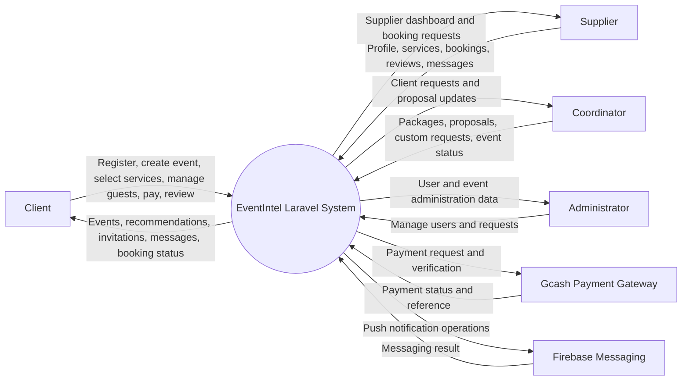

# EventIntel Data Flow Diagram

This DFD represents the active Laravel application flow. Legacy files under `resources/views/userui/php/` are excluded.

## Scope

Included data stores are tables referenced by active routes/controllers:

- `users`
- `events`
- `supplier_services`
- `invitations`
- `guests`
- `custom_event_requests`
- `coordinator_proposals`
- `event_supplier_reviews`
- `event_review_links`
- `user_service_bookmarks`
- `payments`
- `reviews`

The following are intentionally excluded because they are framework-only, legacy, unused, or not part of the active event workflow: `cache`, `cache_locks`, `jobs`, `failed_jobs`, `password_reset_tokens`, `sessions`, `3A_tbl`, `event_services`, and the old standalone PHP pages. Optional coordinator tables such as `coordinator_profile`, `coordinator_gallery`, `coordinator_packages`, `coordinator_reviews`, and `coordinator_messages` are also excluded from the core DFD because the current database does not create them and the application only accesses them conditionally.

## Context Diagram

## Level 1 DFD: Event Planning and Services

```mermaid
flowchart TB
    Client[Client]
    Supplier[Supplier]
    Coordinator[Coordinator]
    Admin[Administrator]
    Gateway[Gcash Payment Gateway]

    P1((1. Authenticate and manage profiles))
    P2((2. Browse and recommend services))
    P3((3. Create and manage event))
    P4((4. Coordinate bookings and proposals))
    P5((5. Manage invitation and guests))
    P6((6. Process payments))
    P7((7. Manage reviews and ratings))
    P8((8. Manage users and requests))

    D1[(users)]
    D2[(events)]
    D3[(supplier_services)]
    D4[(invitations)]
    D5[(guests)]
    D6[(custom_event_requests)]
    D7[(coordinator_proposals)]
    D8[(event_supplier_reviews)]
    D9[(event_review_links)]
    D10[(user_service_bookmarks)]
    D11[(payments)]
    D12[(reviews)]

    Client -->|Credentials and profile data| P1
    P1 <--> D1
    P1 -->|Authenticated account| Client

    Client -->|Search, filters, event preferences| P2
    P2 <--> D2
    P2 <--> D3
    P2 <--> D10
    P2 -->|Recommendations and supplier catalog| Client
    Client -->|Bookmarks| D10

    Client -->|Event details, date, venue, services| P3
    P3 <--> D2
    P3 -->|Read supplier capacity and availability| D3
    P3 -->|Create invitation record| D4
    P3 -->|Planning event| Client

    Client -->|Coordinator booking or custom request| P4
    P4 <--> D1
    P4 <--> D2
    P4 -->|Custom request| D6
    Coordinator -->|Proposal and status update| P4
    P4 <--> D7
    P4 -->|Booking and proposal status| Client
    P4 -->|Request details| Coordinator
    Supplier -->|Booking response and status| P4
    P4 -->|Supplier booking details| Supplier

    Client -->|Invitation edits and guest details| P5
    P5 <--> D2
    P5 <--> D4
    P5 <--> D5
    P5 -->|Invitation and RSVP status| Client
    P5 -->|Guest/RSVP information| Client

    Client -->|Payment request| P6
    P6 <--> D2
    P6 <--> D11
    P6 <--> Gateway
    P6 -->|Payment status| Client

    Client -->|Review and rating| P7
    P7 <--> D2
    P7 <--> D8
    P7 <--> D9
    P7 <--> D12
    P7 -->|Updated supplier rating| D3
    P7 -->|Review confirmation| Client

    Admin -->|User/request actions| P8
    P8 <--> D1
    P8 <--> D2
    P8 -->|Administration results| Admin
```

## Entity Relationships

The complete ERD is maintained separately in [docs/eventintel-erd.md](eventintel-erd.md). It contains only tables referenced by active Laravel controllers and routes.

## Notes

- `events` is the central store for event details, selected supplier names, coordinator status, payment status, and event lifecycle status.
- `supplier_services` supplies catalog data, capacity, availability checks, supplier matching, and ratings.
- `invitations` and `guests` support invitation editing, RSVP, QR/guest management, and event attendance flows.
- `event_review_links` and `event_supplier_reviews` support public review links and event-specific supplier reviews.
- Some controller references are guarded by `Schema::hasTable(...)`; those conditional stores are not shown in the core diagram unless they are present and active in the current database.
