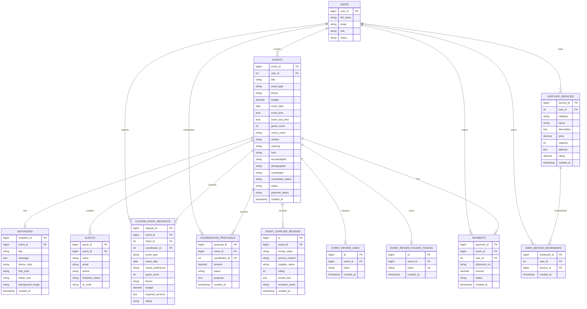
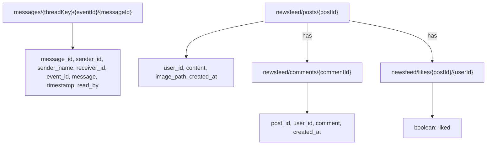

# EventIntel Entity Relationship Diagram

This ERD includes only tables referenced by active Laravel controllers and routes. Legacy standalone PHP pages, framework tables, and conditional tables that are not part of the current active schema are excluded.

## ERD

## Firebase Realtime Database

Firebase is used as a separate document tree for messaging and the newsfeed. These paths are not MySQL tables and are shown separately from the relational ERD.

## Included Tables

- `users`: authentication, roles, profiles, clients, suppliers, coordinators, and administrators.
- `events`: central event record and selected service/coordinator/payment status.
- `supplier_services`: supplier catalog, capacity, pricing, availability, and ratings.
- `invitations` and `guests`: invitation and RSVP management.
- `custom_event_requests` and `coordinator_proposals`: coordinator booking workflow.
- `event_supplier_reviews`, `event_review_links`, and `event_review_folder_tokens`: event-specific review workflow and review sessions.
- `user_service_bookmarks`: saved supplier services.
- `payments`: referenced by the GCash payment webhook and payment status flow.

## Excluded Tables

These are excluded because they are framework-only, legacy, unused by active Laravel event features, or conditionally referenced without a current schema:

- `cache`, `cache_locks`, `jobs`, `job_batches`, `failed_jobs`, `password_reset_tokens`, and `sessions`
- `3A_tbl`, the legacy student-management table
- `event_services`, which is checked conditionally but is not created in the current database
- `coordinator_profile`, `coordinator_gallery`, `coordinator_packages`, and `coordinator_reviews`, which are accessed conditionally but are not present in the current migration set
- Legacy PHP pages under `resources/views/userui/php/`

## Schema Note

`payments`, `guests`, and `coordinator_proposals` are directly referenced by active controllers, but their table-creation migrations are not included in the current migration directory. Their displayed columns are therefore based on the fields used by those controllers. The ERD shows application relationships, not database-enforced foreign keys.

`event_supplier_reviews.review_token` separates reviews submitted through different QR/link sessions. `event_review_links` receives a new token whenever QR & Link is generated, while `event_review_folder_tokens` creates one reusable token per event for the authenticated Review Folder.

Firebase Realtime Database uses the paths shown above. Message threads are keyed by event and participant IDs; newsfeed posts, comments, and likes are stored under their respective Firebase branches.
