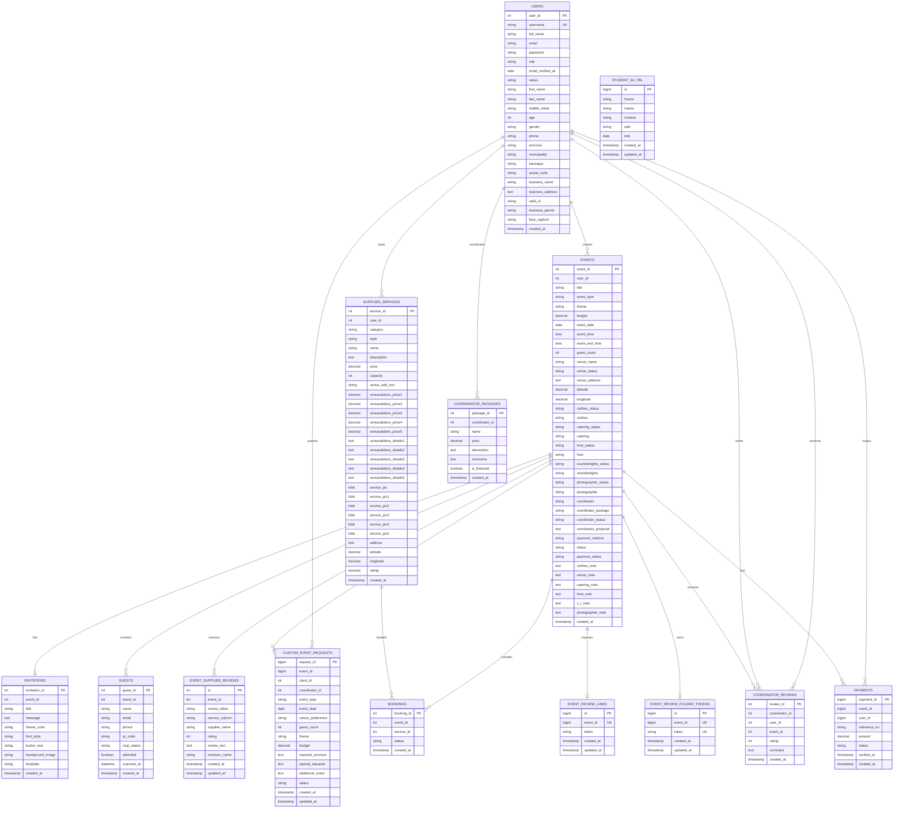
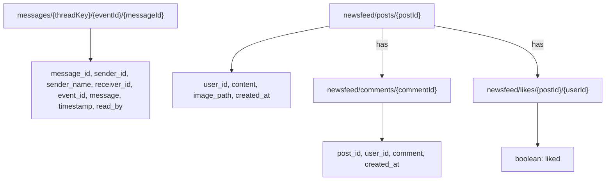

# EventIntel Entity Relationship Diagram

This ERD reflects the business and legacy tables that exist in the current MySQL database. Laravel framework tables and Firebase paths are documented separately. The diagram shows application relationships inferred from matching ID columns; the current schema does not define database foreign-key constraints for these relationships.

## ERD

`COORDINATOR_PROPOSALS` is intentionally not shown because there is no such table in the current database. Proposal information is stored in `events.coordinator_proposal`, while request information is stored in `custom_event_requests`.

`EVENT_SUPPLIER_REVIEWS` is not directly connected to `SUPPLIER_SERVICES` because it stores the supplier name and selected event service column as text rather than a `service_id`. The Mermaid field `s_l_note` represents the physical MySQL column named `s&l_note`.

## Firebase Realtime Database

Firebase is used as a separate document tree for messaging and the newsfeed. These paths are not MySQL tables and are shown separately from the relational ERD.

## Included Tables

- `users`: authentication, roles, profiles, clients, suppliers, coordinators, and administrators.
- `events`: central event record and selected service/coordinator/payment status.
- `supplier_services`: supplier catalog, capacity, pricing, availability, and ratings.
- `invitations` and `guests`: invitation and RSVP management.
- `custom_event_requests`: coordinator booking requests.
- `bookings`: event-to-supplier-service booking links.
- `coordinator_packages` and `coordinator_reviews`: coordinator packages and feedback.
- `event_supplier_reviews`, `event_review_links`, and `event_review_folder_tokens`: event-specific review workflow and review sessions.
- `payments`: referenced by the GCash payment webhook and payment status flow.
- `3a_tbl`: legacy student-management data.

## Excluded Tables

These tables exist in the database but are not shown in the business ERD because they support Laravel infrastructure:

- `cache`, `cache_locks`, `jobs`, `job_batches`, and `failed_jobs`
- `migrations`, `password_reset_tokens`, and `sessions`

## Schema Note

`payments` is created by the `2026_09_20_000000_create_payments_table` migration. It stores online checkout records and webhook verification status. Cash payments remain represented by `events.payment_method` and `events.payment_status`.

`bookings`, `invitations`, and `guests` exist in the database dump but do not have matching current Laravel creation migrations in this repository. `coordinator_packages`, `coordinator_reviews`, and `3a_tbl` also exist in the database dump and are retained here even though they are legacy or conditional application areas.

`event_supplier_reviews.review_token` separates reviews submitted through different QR/link sessions. `event_review_links` receives a new token whenever QR & Link is generated, while `event_review_folder_tokens` creates one reusable token per event for the authenticated Review Folder.

ID columns are shown as relationships based on application usage and matching names. The database currently uses indexes and unique keys but does not enforce these business relationships with foreign-key constraints.

Firebase Realtime Database uses the paths shown above. Message threads are keyed by event and participant IDs; newsfeed posts, comments, and likes are stored under their respective Firebase branches.
