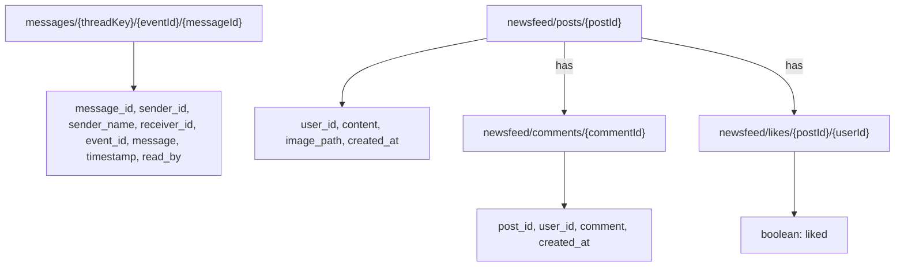

# EventIntel Entity Relationship Diagram

This ERD reflects the active business tables in the current MySQL database. Laravel framework tables, unused legacy tables, and Firebase paths are documented separately. Entity names use the exact physical table names. The diagram shows application relationships inferred from matching ID columns; the current schema does not define database foreign-key constraints for these relationships.

## ERD

```mermaid
erDiagram
    users {
        int user_id PK
        string username UK
        string full_name
        string email UK
        string password
        string role
        date email_verified_at
        string status
        string first_name
        string last_name
        string middle_initial
        int age
        string gender
        string phone
        string province
        string municipality
        string barangay
        string postal_code
        string business_name
        text business_address
        string valid_id
        string business_permit
        string face_capture
        timestamp created_at
    }

    events {
        int event_id PK
        int user_id FK
        string title
        string event_type
        string theme
        decimal budget
        date event_date
        time event_time
        time event_end_time
        int guest_count
        string venue_name
        string venue_status
        text venue_address
        decimal latitude
        decimal longitude
        string clothes_status
        string clothes
        string catering_status
        string catering
        string host_status
        string host
        string soundsnlights_status
        string soundsnlights
        string photographer_status
        string photographer
        string coordinator
        string coordinator_package
        string coordinator_status
        text coordinator_proposal
        string payment_method
        string status
        string payment_status
        text clothes_note
        text venue_note
        text catering_note
        text host_note
        text s_l_note
        text photographer_note
        timestamp created_at
    }

    supplier_services {
        int service_id PK
        int user_id FK
        string category
        string style
        string name
        text description
        decimal price
        int capacity
        string venue_add_ons
        decimal venueaddons_price1
        decimal venueaddons_price2
        decimal venueaddons_price3
        decimal venueaddons_price4
        decimal venueaddons_price5
        text venueaddons_details1
        text venueaddons_details2
        text venueaddons_details3
        text venueaddons_details4
        text venueaddons_details5
        blob service_pic
        blob service_pic1
        blob service_pic2
        blob service_pic3
        blob service_pic4
        blob service_pic5
        text address
        decimal latitude
        decimal longitude
        decimal rating
        timestamp created_at
    }

    invitations {
        int invitation_id PK
        int event_id FK
        string title
        text message
        string theme_color
        string font_style
        string button_text
        string background_image
        string template
        timestamp created_at
    }

    guests {
        int guest_id PK
        int event_id FK
        string name
        string email
        string phone
        string qr_code
        string rsvp_status
        boolean attended
        datetime scanned_at
        timestamp created_at
    }

    custom_event_requests {
        bigint request_id PK
        bigint event_id FK
        int client_id FK
        int coordinator_id FK
        string event_type
        date event_date
        string venue_preference
        int guest_count
        string theme
        decimal budget
        text required_services
        text special_requests
        text additional_notes
        string status
        timestamp created_at
        timestamp updated_at
    }

    coordinator_packages {
        int package_id PK
        int coordinator_id FK
        string name
        decimal price
        text description
        text inclusions
        boolean is_featured
        timestamp created_at
    }

    coordinator_reviews {
        int review_id PK
        int coordinator_id FK
        int user_id FK
        int event_id FK
        int rating
        text comment
        timestamp created_at
    }

    event_supplier_reviews {
        int id PK
        int event_id FK
        string review_token
        string service_column
        string supplier_name
        int rating
        text review_text
        string reviewer_name
        timestamp created_at
        timestamp updated_at
    }

    event_review_links {
        bigint id PK
        bigint event_id FK UK
        string token UK
        timestamp created_at
        timestamp updated_at
    }

    event_review_folder_tokens {
        bigint id PK
        bigint event_id FK UK
        string token UK
        timestamp created_at
        timestamp updated_at
    }

    payments {
        bigint payment_id PK
        bigint event_id FK
        bigint user_id FK
        string reference_no UK
        decimal amount
        string status
        timestamp verified_at
        timestamp created_at
    }


    users ||--o{ events : "user_id -> user_id"
    users ||--o{ supplier_services : "user_id -> user_id"
    users ||--o{ custom_event_requests : "client_id/coordinator_id -> user_id"
    users ||--o{ coordinator_packages : "coordinator_id -> user_id"
    users ||--o{ coordinator_reviews : "coordinator_id/user_id -> user_id"
    users ||--o{ payments : "user_id -> user_id"

    events ||--o{ invitations : "event_id -> event_id"
    events ||--o{ guests : "event_id -> event_id"
    events ||--o{ custom_event_requests : "event_id -> event_id"
    events ||--o{ coordinator_reviews : "event_id -> event_id"
    events ||--o{ event_supplier_reviews : "event_id -> event_id"
    events ||--o| event_review_links : "event_id -> event_id (unique)"
    events ||--o| event_review_folder_tokens : "event_id -> event_id (unique)"
    events ||--o{ payments : "event_id -> event_id"
```

## Keys and Relationships

- `users`: primary key `user_id`; unique keys `username` and `email`.
- `events`: primary key `event_id`; logical foreign key `user_id` references `users.user_id`.
- `supplier_services`: primary key `service_id`; logical foreign key `user_id` references `users.user_id`.
- `invitations`: primary key `invitation_id`; logical foreign key `event_id` references `events.event_id`.
- `guests`: primary key `guest_id`; logical foreign key `event_id` references `events.event_id`.
- `custom_event_requests`: primary key `request_id`; logical foreign keys `event_id`, `client_id`, and `coordinator_id` reference `events.event_id` and `users.user_id`.
- `coordinator_packages`: primary key `package_id`; logical foreign key `coordinator_id` references `users.user_id`.
- `coordinator_reviews`: primary key `review_id`; logical foreign keys `coordinator_id` and `user_id` reference `users.user_id`, and `event_id` references `events.event_id`.
- `event_supplier_reviews`: primary key `id`; logical foreign key `event_id` references `events.event_id`; unique key `(event_id, service_column, review_token)`.
- `event_review_links`: primary key `id`; unique keys `event_id` and `token`; logical foreign key `event_id` references `events.event_id`.
- `event_review_folder_tokens`: primary key `id`; unique keys `event_id` and `token`; logical foreign key `event_id` references `events.event_id`.
- `payments`: primary key `payment_id`; unique key `reference_no`; logical foreign keys `event_id` and `user_id` reference `events.event_id` and `users.user_id`.

The dump defines indexes and unique keys but no database-enforced foreign-key constraints. The relationships above are inferred from application joins and matching column names.

`coordinator_proposals` is intentionally not shown because there is no such table in the current database. Proposal information is stored in `events.coordinator_proposal`, while request information is stored in `custom_event_requests`.

`event_supplier_reviews` is not directly connected to `supplier_services` because it stores the supplier name and selected event service column as text rather than a `service_id`. The Mermaid field `s_l_note` represents the physical MySQL column named `s&l_note`.

## Firebase Realtime Database

Firebase is used as a separate document tree for messaging and the newsfeed. These paths are not MySQL tables and are shown separately from the relational ERD.



## Included Tables

- `users`: authentication, roles, profiles, clients, suppliers, coordinators, and administrators.
- `events`: central event record and selected service/coordinator/payment status.
- `supplier_services`: supplier catalog, capacity, pricing, availability, and ratings.
- `invitations` and `guests`: invitation and RSVP management.
- `custom_event_requests`: coordinator booking requests.
- `coordinator_packages` and `coordinator_reviews`: coordinator packages and feedback.
- `event_supplier_reviews`, `event_review_links`, and `event_review_folder_tokens`: event-specific review workflow and review sessions.
- `payments`: referenced by the GCash payment webhook and payment status flow.

## Excluded Tables

These tables exist in the database but are not shown in the business ERD because they support Laravel infrastructure:

- `cache`, `cache_locks`, `jobs`, `job_batches`, and `failed_jobs`
- `migrations`, `password_reset_tokens`, and `sessions`

The unused legacy tables `bookings` and `3a_tbl` are also omitted from the business ERD. Conditional tables referenced by code but not present in the current database, including `coordinator_profile`, `coordinator_gallery`, `coordinator_messages`, `event_services`, `user_service_bookmarks`, and `coordinator_proposals`, are omitted as well.

## Schema Note

`payments` is created by the `2026_09_20_000000_create_payments_table` migration. It stores online checkout records and webhook verification status. Cash payments remain represented by `events.payment_method` and `events.payment_status`.

`invitations` and `guests` exist in the database dump but do not have matching current Laravel creation migrations in this repository. `coordinator_packages` and `coordinator_reviews` exist in the database dump and are retained because the coordinator workflow reads and manages them conditionally.

`event_supplier_reviews.review_token` separates reviews submitted through different QR/link sessions. `event_review_links` receives a new token whenever QR & Link is generated, while `event_review_folder_tokens` creates one reusable token per event for the authenticated Review Folder.

ID columns are shown as relationships based on application usage and matching names. The database currently uses indexes and unique keys but does not enforce these business relationships with foreign-key constraints.

Firebase Realtime Database uses the paths shown above. Message threads are keyed by event and participant IDs; newsfeed posts, comments, and likes are stored under their respective Firebase branches.
